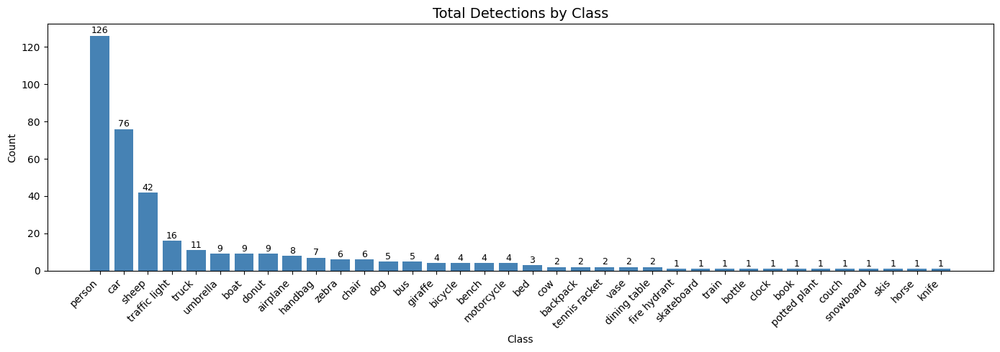

# 🎭 Instance Segmentation with Mask R-CNN

> Pixel-level object detection and segmentation using Mask R-CNN on the MS-COCO dataset.


---

## 📌 Overview

This project demonstrates **instance segmentation** using [Mask R-CNN](https://arxiv.org/abs/1703.06870) (He et al., 2017) — a framework that simultaneously performs object detection, classification, and pixel-level mask prediction.

Unlike semantic segmentation (which labels every pixel with a class), instance segmentation distinguishes between **individual object instances** of the same class — e.g., detecting 3 separate people rather than one merged "person" region.

The project is applied in the context of **Intelligent Transportation Systems (ITS)** — detecting and segmenting road users and infrastructure objects (vehicles, pedestrians, traffic lights, stop signs) at pixel level, which is a core requirement for autonomous driving and traffic monitoring systems.

Key metric used: **Intersection over Union (IoU)** — measures overlap between predicted mask and ground truth.

---

## 🧠 Model Architecture

Mask R-CNN extends Faster R-CNN with a parallel **mask prediction branch**:

```
Input Image
    │
    ▼
ResNet + FPN Backbone  ──→  Feature Maps
    │
    ▼
Region Proposal Network (RPN)
    │
    ▼
RoIAlign (precise pixel alignment)
    │
    ├──→ Classification Head  (What class?)
    ├──→ Bounding Box Head    (Where is it?)
    └──→ Mask Head            (Which pixels?)
```

Pre-trained weights from MS-COCO (80 object categories) are used for inference.

---

## 🗂️ Repository Structure

```
mask-rcnn-segmentation/
├── Masked_RCNN_Image_Segmentation.ipynb   # Main notebook
├── images/                                 # Input test images
├── outputs/                                # Segmentation results
├── requirements.txt                        # Python dependencies
└── README.md
```

---

## ⚙️ Setup & Usage

### Prerequisites
- Python 3.8
- TensorFlow 2.13
- Google Colab recommended (GPU runtime)

### Quick Start

**Option 1 — Google Colab (Recommended)**

[](https://colab.research.google.com/)

1. Upload `Masked_RCNN_Image_Segmentation.ipynb` to Colab
2. Set runtime to **GPU**
3. Run all cells — dependencies install automatically

**Option 2 — Local Setup**

```bash
git clone https://github.com/madhumitha-murthy/mask-rcnn-segmentation.git
cd mask-rcnn-segmentation
pip install -r requirements.txt
jupyter notebook Masked_RCNN_Image_Segmentation.ipynb
```

### What the Notebook Does

| Step | Description |
|------|-------------|
| 1 | Install `h5py>=3.0` and clone akTwelve's TF2-compatible Mask R-CNN repo |
| 2 | Clone COCO API and compile PythonAPI |
| 3 | Download pre-trained COCO weights (`mask_rcnn_coco.h5`) |
| 4 | Configure model for single-image inference |
| 5 | Load model and pre-trained weights |
| 6 | Run detection on all images — visualise masks, bounding boxes, and confidence scores |
| 7 | Save annotated results to `outputs/` |
| 8 | Print detection metrics summary and transportation-specific object counts; generate class distribution chart |

---

## 📦 Dependencies

```
tensorflow>=2.13.0
h5py>=3.0
numpy>=1.22,<=1.24.3
scikit-image
matplotlib
opencv-python
pycocotools
```

---

## 📊 Sample Output

The model outputs per-image:
- **Bounding boxes** around each detected instance
- **Class labels** with confidence scores
- **Binary masks** at pixel level, colour-coded per instance

After running on all 29 images, a detection metrics summary is printed including:
- Total objects detected and average per image
- Average, min, and max confidence scores
- Full class breakdown
- Transportation-specific object counts (vehicles, pedestrians, traffic infrastructure)
- Class distribution bar chart saved to `outputs/class_distribution.png`

80 COCO classes supported, including: `person`, `car`, `bus`, `truck`, `bicycle`, `traffic light`, `stop sign`, and more.



---

## 📚 References

- He, K. et al. (2017). [Mask R-CNN](https://arxiv.org/abs/1703.06870). *ICCV 2017*.
- Matterport Mask R-CNN Implementation: [github.com/matterport/Mask_RCNN](https://github.com/matterport/Mask_RCNN)
- MS-COCO Dataset: [cocodataset.org](https://cocodataset.org/)

---

## 👩‍💻 Author

**Madhumitha Murthy**  
MSc Computer Control & Automation, Nanyang Technological University  
[LinkedIn](http://www.linkedin.com/in/madhumitha-murthy-4801b7223) · [GitHub](https://github.com/madhumitha-murthy)
